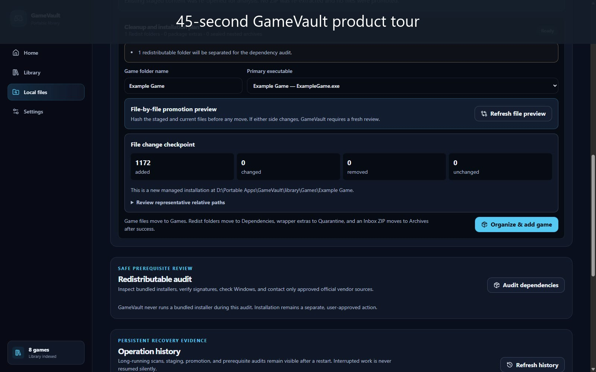
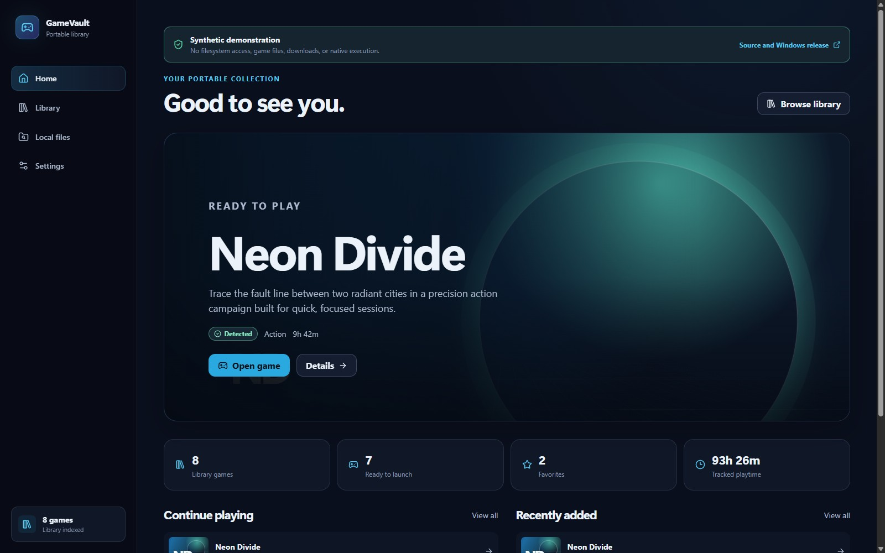
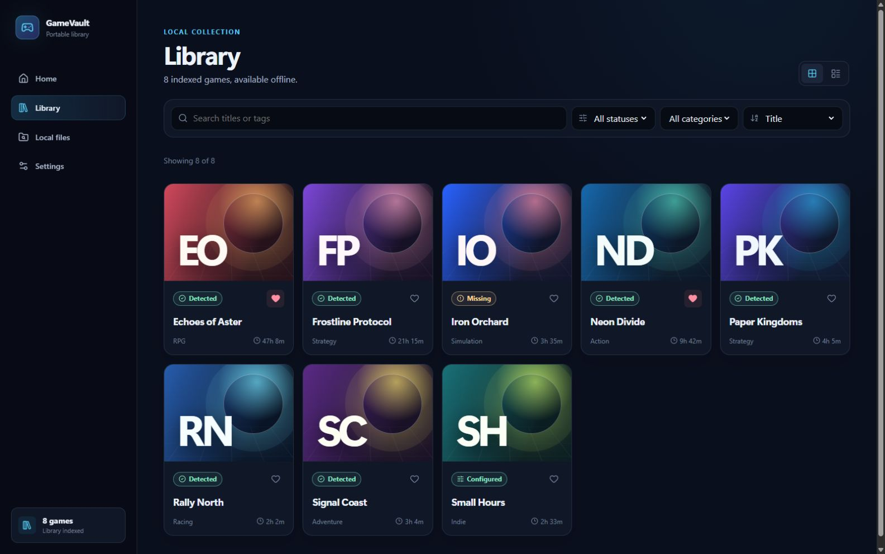
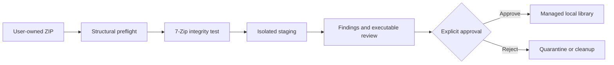
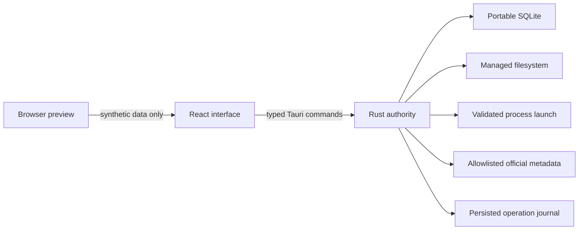

<p align="center">
  
</p>

<h1 align="center">GameVault</h1>

<p align="center"><strong>A portable, local-first Windows game library with a review-gated archive intake pipeline.</strong></p>

<p align="center">
  Organize and launch games you already own, review untrusted ZIPs before they enter your library, and keep your catalog portable without an account, telemetry, or a mandatory cloud service.
</p>

<p align="center">
  <a href="https://nouraldinfarge.github.io/gamevault/"><strong>Try the synthetic demo</strong></a>
  · <a href="https://github.com/NouraldinFarge/gamevault/releases/latest"><strong>Download for Windows</strong></a>
  · <a href="#safety-model">Safety model</a>
  · <a href="#build-and-verify">Build from source</a>
  · <a href="https://nouraldinfarge.github.io/">Engineering portfolio</a>
</p>

<p align="center">
  <a href="https://github.com/NouraldinFarge/gamevault/actions/workflows/ci.yml"></a>
  <a href="https://github.com/NouraldinFarge/gamevault/actions/workflows/codeql.yml"></a>
  <a href="https://github.com/NouraldinFarge/gamevault/actions/workflows/dependency-audit.yml"></a>
  <a href="https://github.com/NouraldinFarge/gamevault/releases/latest"></a>
  <a href="LICENSE"></a>
</p>

<p align="center"><sub>Windows 10/11 x64 · Portable ZIP · No installer · Currently unsigned · Active 2026 portfolio project · Latest public release 0.3.5 · Development build 0.4.0-dev.0 (source only)</sub></p>

[](docs/media/gamevault-product-tour.mp4)

[Read the time-coded product-tour transcript](docs/media/gamevault-product-tour-transcript.md).

<p align="center">
  <a href="https://nouraldinfarge.github.io/gamevault/">Open the zero-authority synthetic demo</a>
  · <a href="docs/DEMO.md">Follow the five-minute guided tour</a>
</p>

## Why GameVault

Most launchers optimize acquisition and cloud services. GameVault focuses on a different problem: maintaining a clean, portable view of locally stored games while treating every archive and saved path as untrusted input.

| What GameVault does | What it deliberately does not do |
| --- | --- |
| Indexes and launches local games the user already owns | Download, redistribute, crack, or patch games |
| Preflights, integrity-tests, stages, and presents ZIP findings for review | Silently extract, promote, or execute archive content |
| Keeps SQLite state and the managed `library/` beside the portable executable by default | Require an account, telemetry, or a cloud connection to launch |
| Enriches catalog entries from strictly approved official Steam, GOG, and Epic URLs | Claim ownership, antivirus scanning, sandboxing, or guaranteed archive safety |

## Product tour

[](docs/images/gamevault-home.jpg)

### 1. Search and organize offline

Filter titles, categories, status, favorites, and launch readiness without a network dependency.

[](docs/images/gamevault-library.jpg)

### 2. Review local files and archive intake

Keep Inbox, Staging, Games, Dependencies, Quarantine, Archives, and Reports visibly separated.

[](docs/images/gamevault-local-files.jpg)

All screenshots use synthetic game names and procedural artwork. No commercial game files, cover art, or private library data are included.

Capture provenance, privacy rules, and refresh guidance are documented in [`docs/images/README.md`](docs/images/README.md).

## Safety model



Before extraction, GameVault inspects entry count, expanded size, compression ratio, Windows paths, NTFS streams, device names, case collisions, and link/reparse metadata. Structurally safe archives are then fully tested with 7-Zip and extracted only into a unique staging directory.

- Path traversal, absolute or drive-relative paths, links/reparse points, unsafe Windows names, excessive expansion, and modified-platform markers block intake or promotion.
- Nested archives remain sealed and are never recursively expanded.
- Archive content is never executed during inspection.
- Staging folders survive a restart as a visible recovery queue; interrupted work is recorded and is never resumed silently.
- Every promotion requires a freshly reviewed file-level diff. A SHA-256 content fingerprint is recomputed immediately before any move so a changed staging tree cannot reuse an older approval.
- Promotion requires explicit review and uses a rollback journal that can restore staging, separated prerequisites, the Inbox ZIP, and a previous installed version.
- Redistributable review records the bundled hash, signature, expected publisher, installed-version evidence, detection method, and confidence without running an installer.
- Runtime DLLs remain with their game; GameVault does not perform unsafe cross-game deduplication.

Read the complete [security policy](SECURITY.md) and [architecture trust boundaries](docs/ARCHITECTURE.md).

## Evidence, not promises

| Evidence | Current repository gate |
| --- | --- |
| Frontend behavior | TypeScript validation, production build, 12 Vitest contract/component/scale tests, and 18 desktop/mobile browser journeys |
| Accessibility | Keyboard skip-navigation coverage and automated axe checks with zero serious or critical findings across every primary view at desktop and narrow widths |
| Native authority | Rust formatting, Clippy with warnings denied, and 50 Rust tests, including property-generated archive/path cases |
| Hostile inputs | Traversal, device names, NTFS streams, case collisions, links/reparse points, allowlist lookalikes, stale-update fingerprints, rollback, backup restore, launch-boundary regression tests, and a compiling libFuzzer target |
| Portable runtime | Renamed-executable, path-with-spaces, portable-database, state-preservation, health-check, deterministic identical-input ZIP, signing-hook fail-closed, and no-installer probes |
| Supply chain | Full JavaScript and Rust audits, CodeQL, immutable action pins, SHA-256 checksum, SPDX SBOM, and GitHub SLSA provenance |

See the latest [GitHub Actions results](https://github.com/NouraldinFarge/gamevault/actions) and the immutable [v0.3.5 release](https://github.com/NouraldinFarge/gamevault/releases/tag/v0.3.5).

The repository is currently working toward the `0.4.0` milestone under the synchronized source identity `0.4.0-dev.0`. It is not a public-download or release claim; [`docs/RELEASE_STATUS.md`](docs/RELEASE_STATUS.md) explains the boundary and remaining publication gates, while [`release-status.json`](release-status.json) exposes the distinction in machine-readable form.

## Architecture



Rust owns filesystem, process, SQLite, archive, URL, and metadata authority. The React browser preview has synthetic data and no native filesystem capability.

| Area | Responsibility |
| --- | --- |
| [`src`](src) | React 19 interface, library, local-files, settings, and shared components |
| [`src-tauri/src`](src-tauri/src) | Rust archive review, path safety, process launch, SQLite, metadata, and recovery |
| [`tests`](tests) | Synthetic product and trust-boundary fixtures |
| [`build`](build) | Portable staging, verification, packaging, deployment, and rollback scripts |

## Download and run

1. Open the [latest release](https://github.com/NouraldinFarge/gamevault/releases/latest).
2. Download `GameVault-v0.3.5-windows-x64-portable.zip` and its `.sha256` file.
3. Verify the archive, extract it to a writable folder, and start `GameVault.exe`.

```powershell
$archive = ".\GameVault-v0.3.5-windows-x64-portable.zip"
$expected = ((Get-Content -LiteralPath "$archive.sha256" -Raw).Trim() -split '\s+')[0].ToLowerInvariant()
if ($expected -notmatch '^[0-9a-f]{64}$') { throw "GameVault checksum file is invalid" }
$actual = (Get-FileHash -LiteralPath $archive -Algorithm SHA256).Hash.ToLowerInvariant()
if ($actual -ne $expected) { throw "GameVault archive checksum mismatch" }
"Verified SHA-256: $actual"
```

Microsoft Edge WebView2 is required to display the desktop interface. An installed 7-Zip copy is required only for ZIP intake. The portable executable is not yet Authenticode-signed, so verify the published checksum and GitHub provenance before running it.

## Build and verify

Prerequisites: Windows 10/11, Node.js 24, pnpm 11, the pinned Rust 1.96 MSVC toolchain, Visual Studio C++ Build Tools, 7-Zip, and Microsoft Edge WebView2.

```powershell
pnpm install --frozen-lockfile
pnpm verify
pnpm exec playwright install chromium
pnpm test:e2e
cargo fmt --manifest-path src-tauri/Cargo.toml --all --check
cargo clippy --manifest-path src-tauri/Cargo.toml --all-targets --locked -- -D warnings
cargo test --manifest-path src-tauri/Cargo.toml --locked
```

Use `pnpm dev` for the synthetic browser preview or `cargo run --manifest-path src-tauri/Cargo.toml` for the complete Tauri desktop authority. Double-click `BUILD-LATEST.bat` to run the installer-free portable release pipeline. Application update checks are manual: Settings reads the latest stable release identity from the official GitHub API and opens the exact reviewed release page, but never downloads or installs it.

## Project guide

| Document | Start here when you want to… |
| --- | --- |
| [Synthetic demo guide](docs/DEMO.md) | Tour the public browser preview and understand its authority boundary |
| [Release status](docs/RELEASE_STATUS.md) | Distinguish the latest public artifact from the next source milestone |
| [Product-tour transcript](docs/media/gamevault-product-tour-transcript.md) | Read the silent 45-second walkthrough without playing video |
| [Architecture](docs/ARCHITECTURE.md) | Understand native authority, portable state, and recovery |
| [Performance](docs/PERFORMANCE.md) | Review scale limits, bounded rendering, and the reproducible benchmark fixture |
| [Security policy](SECURITY.md) | Review trust boundaries or report a vulnerability privately |
| [Release checklist](docs/RELEASE_CHECKLIST.md) | Reproduce the verified release process |
| [Contributing](CONTRIBUTING.md) | Propose and verify a safe change |
| [Support](SUPPORT.md) | Choose the right path for setup help, bugs, ideas, or security reports |
| [Community standards](CODE_OF_CONDUCT.md) | Understand the behavior expected in project spaces |
| [Dependency policy](DEPENDENCY_POLICY.md) | Understand update and audit decisions |
| [Roadmap](ROADMAP.md) | See completed foundations, next work, and non-goals |
| [Changelog](CHANGELOG.md) | Review version-by-version product changes |

## Development approach

AI tools supported research, implementation, debugging, documentation, and testing. Nouraldin Farge retained ownership of product direction, architecture, technical review, archive-safety boundaries, verification, release decisions, and published claims. Generated suggestions were treated as untrusted until reviewed against synthetic hostile-input fixtures and automated verification.

## License

GameVault is available under the [MIT License](LICENSE).
