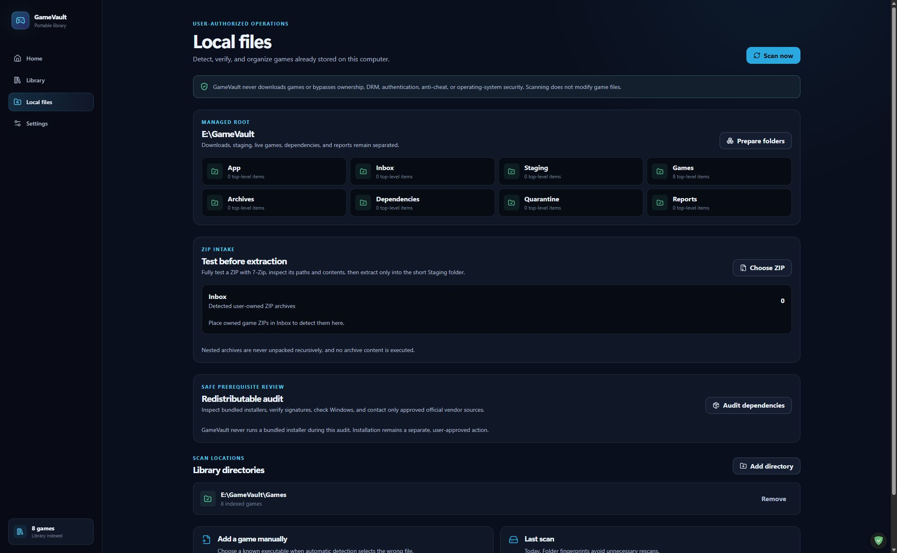
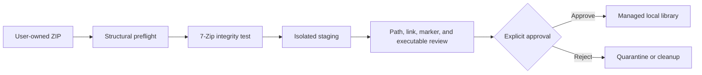

# GameVault

[](https://github.com/NouraldinFarge/gamevault/actions/workflows/ci.yml)
[](https://github.com/NouraldinFarge/gamevault/actions/workflows/codeql.yml)
[](https://github.com/NouraldinFarge/gamevault/actions/workflows/dependency-audit.yml)
[](https://github.com/NouraldinFarge/gamevault/releases)
[](LICENSE)

**A portable, local-first Windows game library and launcher with a review-gated archive intake pipeline.**

Active development · 2026 · Version 0.3.5

GameVault organizes games the user already owns. It never downloads games and never treats an archive as trusted input. ZIPs move through a staged review workflow before they can enter the managed library, while official store pages can supply optional catalog metadata without becoming a launch dependency.

**Try it:** [Download the latest verified Windows release](https://github.com/NouraldinFarge/gamevault/releases/latest) · [Review source](https://github.com/NouraldinFarge/gamevault) · [View Nouraldin Farge's engineering portfolio](https://nouraldin-farge-engineering.awdsqecxzr.chatgpt.site) · [Read the archive-safety boundary](SECURITY.md)

## Product preview


| Review-oriented local files | Searchable library |
| --- | --- |
|  |  |



## What it demonstrates

- **Defensive archive handling:** reject unsafe paths, Windows device names, NTFS streams, case collisions, links/reparse points, and expansion bombs before decompression testing or extraction.
- **Review before execution:** stage content, inspect the detected executable and safety markers, then require explicit approval before promotion.
- **Portable local state:** keep the app database, configuration, and managed `library/` folder beside the executable by default, while allowing the user to choose another dedicated location.
- **Failure-tolerant enrichment:** allowlist Steam, GOG, and Epic product/artwork URLs while ensuring metadata failures never block local launch.
- **Rust desktop authority:** place filesystem, process, and SQLite operations behind a narrow Tauri command boundary.

## Managed ZIP workflow

1. Place a user-owned ZIP in the configured inbox.
2. Preflight entry count, expanded size, compression ratio, Windows paths, case collisions, and link metadata.
3. Fully test the structurally safe archive with 7-Zip, then extract it into a unique staging directory without running any content.
4. Review the proposed executable, redistributables, nested archives, and safety findings.
5. Approve promotion into the managed games directory.
6. Retain update backups, separate bundled prerequisites, and quarantine wrapper extras.

Modified-platform markers, path traversal, and link/reparse entries block installation. Game runtime DLLs are intentionally not deduplicated or stripped.

## Product highlights

- Searchable local library with launch history and per-game details.
- Review-oriented local-files inbox and staged promotion flow.
- Official catalog linking for Steam App IDs and approved Steam, GOG, or Epic URLs.
- Portable executable and ZIP release; no installer target.
- Browser-safe preview data for fast UI development.

## Architecture

| Layer | Responsibility |
| --- | --- |
| `src` | React 19 UI, library, local-files, settings, and shared components |
| `src-tauri/src` | Rust filesystem, process, archive-review, SQLite, and metadata authority |
| `tests` | Product behavior and boundary regression coverage |
| `docs` | Design and operating guidance |
| `BUILD-LATEST.ps1` | Verified portable release workflow |

## Run locally

Prerequisites: Windows 10/11, Node.js 24, pnpm 11, the pinned Rust 1.96 MSVC toolchain, Visual Studio C++ Build Tools, 7-Zip, and Microsoft Edge WebView2.

```powershell
pnpm install
pnpm dev
pnpm verify
cargo test --manifest-path src-tauri/Cargo.toml
cargo run --manifest-path src-tauri/Cargo.toml
```

`pnpm dev` uses browser-safe preview data. Running through Cargo starts the full desktop authority.

## Portable release

Double-click `BUILD-LATEST.bat` to run the release pipeline and produce a portable executable and ZIP. The project deliberately does not configure installer bundle targets.

Fresh installs create the managed game-library layout under `library/` beside the portable executable. Upgrades preserve `data/`, `library/`, logs, and user configuration transactionally, migrate the former forced `E:\GameVault` and `E:\SteamRIPPED` defaults, and leave deliberately chosen custom folders intact.

Future version tags are built on GitHub's Windows runner from the tagged source. That workflow publishes the portable ZIP, SHA-256 checksum, SPDX SBOM, and GitHub artifact-provenance attestation.

## Development approach

AI tools supported research, code generation, debugging, documentation, and testing. Nouraldin Farge made the final architecture, security, and release decisions, reviewed the generated work, and remains accountable for the result. Generated suggestions were treated as untrusted until reviewed against synthetic hostile-input fixtures and automated verification.

See [`docs/ARCHITECTURE.md`](docs/ARCHITECTURE.md), [`docs/RELEASE_CHECKLIST.md`](docs/RELEASE_CHECKLIST.md), [`ROADMAP.md`](ROADMAP.md), [`CONTRIBUTING.md`](CONTRIBUTING.md), and [`SECURITY.md`](SECURITY.md) for the design, verification, and project policies.

## License

MIT — see [`LICENSE`](LICENSE).
