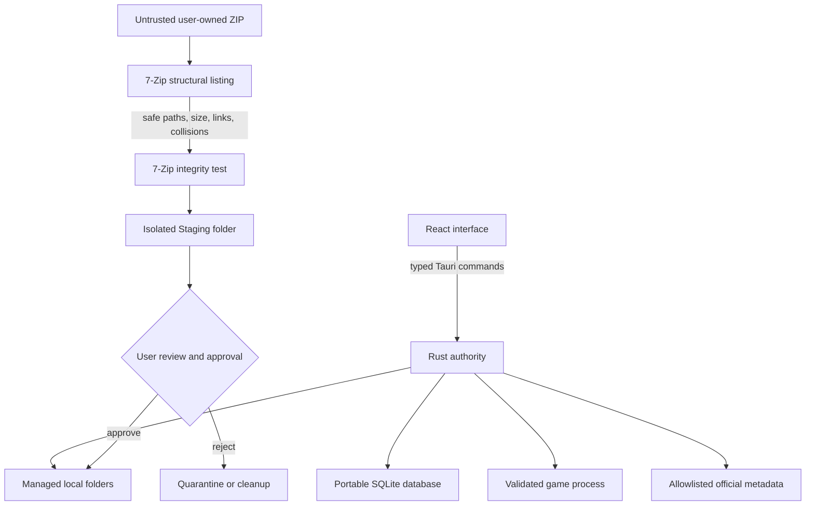

# GameVault architecture

GameVault is a portable, local-first Windows desktop application. React renders the single-window interface; Rust owns every filesystem, process, network, and SQLite operation through a narrow Tauri command boundary. The browser preview uses synthetic data and has no filesystem authority.

## Trust boundaries

- ZIP entries, extracted files, metadata responses, backup files, saved paths, and launch arguments are untrusted inputs.
- Archive preflight happens before the decompression test. It rejects traversal, absolute and drive-relative paths, NTFS alternate streams, reserved Windows device names, case-insensitive collisions, links/reparse metadata, excessive entry counts, excessive expanded size, and extreme compression ratios.
- Extraction never recurses into nested archives and never executes content. The extracted tree is inspected again for links/reparse points and entry limits before review.
- Promotion uses a cleanup move journal. If library registration fails, GameVault restores the staged game, separated redistributables, quarantined wrapper files, source Inbox ZIP, and any previous installed version.
- Executables are canonicalized and must remain inside a real installation directory. Arguments are passed as a bounded array directly to the executable; no command shell is involved.
- Steam, GOG, and Epic store and artwork URLs use exact HTTPS host allowlists. Metadata is size-bounded and never becomes a launch dependency.
- Backup restore requires a valid SQLite integrity check, compatible GameVault tables and settings, and a supported schema/application identity before the active transaction begins.

## Portable state

The default managed root is `library/` beside `GameVault.exe`. A user may select another dedicated physical folder; drive roots and links/reparse points are rejected. A portable upgrade carries forward:

- `data/` — SQLite library and backups
- `library/` — Inbox, Staging, Games, Archives, Dependencies, Quarantine, and Reports
- `config/` — user configuration, while retaining new release defaults
- `logs/` — bounded, redacted local event logs

`cache/` is disposable. The release has no installer, service, scheduled task, shell extension, or registry setup. It depends on the Windows-provided WebView2 Evergreen runtime and an installed 7-Zip copy for archive intake.

GameVault records its current portable root. If the folder later moves, only paths that match the previous default `library/Games` location are rewritten; user-selected custom roots remain unchanged. Restoring a backup first snapshots the active database and then reapplies this portability migration.

## Recovery model

- Database initialization preserves a failed database as a timestamped `library-corrupt-*.db` before creating a new database.
- User-created database backups are SQLite snapshots produced with `VACUUM INTO`.
- Existing games are moved to `Archives/Updates` before an approved update is promoted.
- Portable build deployment extracts and verifies the next build, copies verified user state, swaps `active-build` transactionally, runs a health check, and restores the previous build on failure.

GameVault does not download games, establish ownership, remove or patch DRM/platform components, redistribute game content, or weaken operating-system security.
